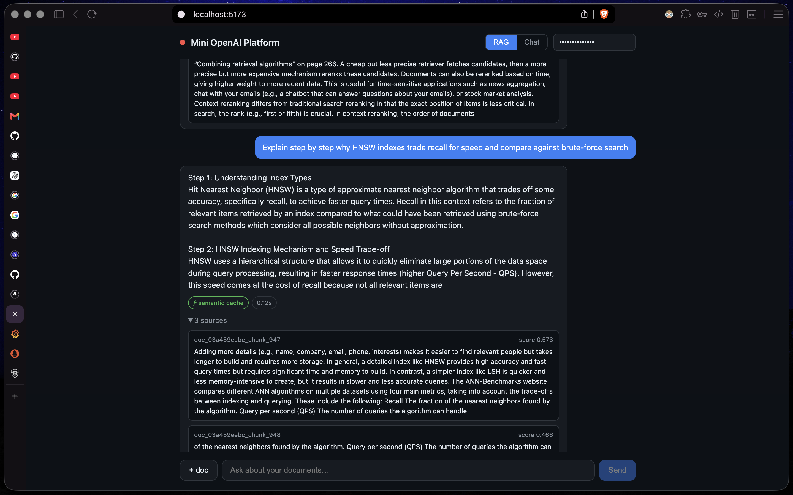
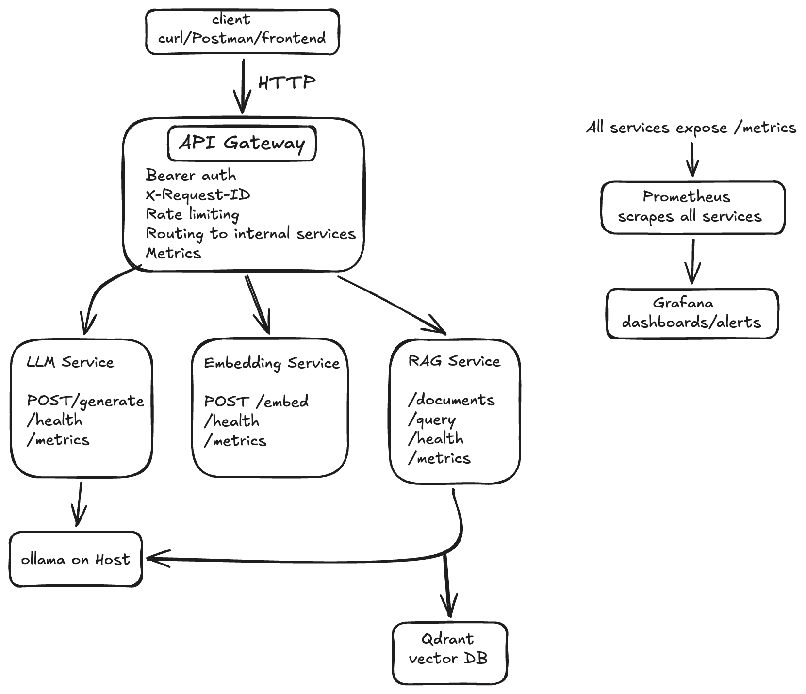
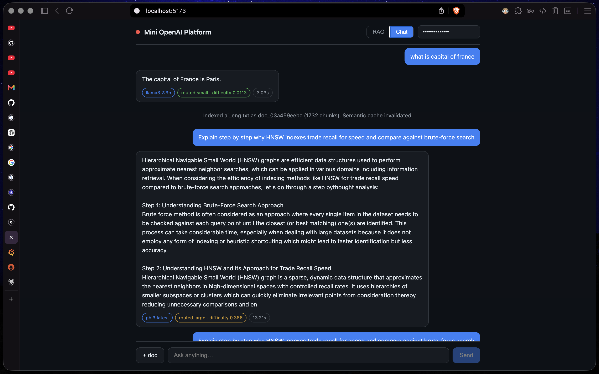
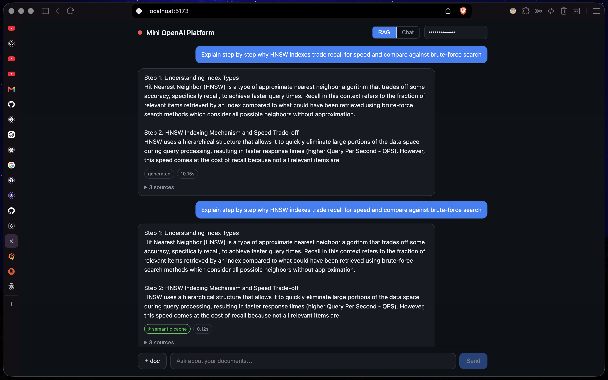
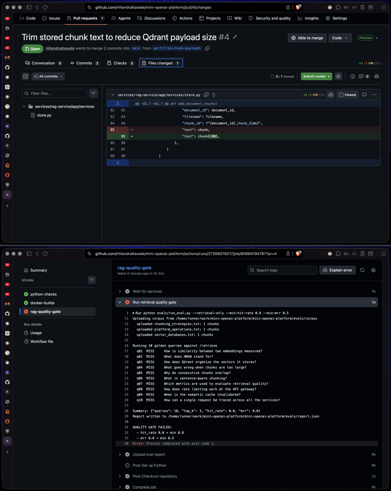
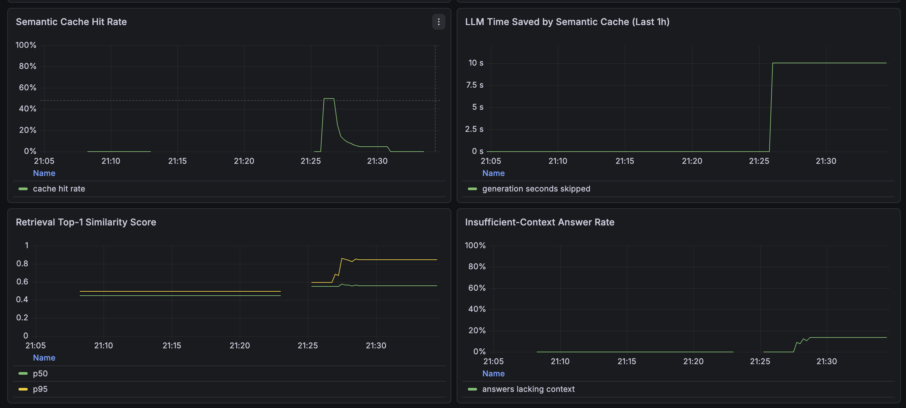
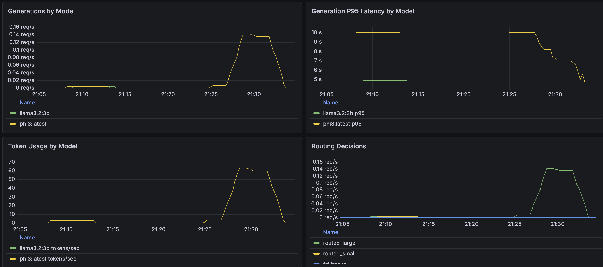

# Mini OpenAI Platform

[](https://github.com/HitendraKawale/mini-openai-platform/actions/workflows/ci.yml)

A **self-evaluating LLM platform**. It serves OpenAI-style APIs for chat, embeddings and RAG — and unlike most RAG stacks, it can tell you whether its answers are good, what they cost, and when quality regresses.

<!-- SCREENSHOT SLOT 1 — hero: frontend showing a cached RAG answer (⚡ badge) with sources expanded. Ideally a short demo GIF (docs/images/demo.gif) instead of a static image. -->


## Why this isn't another RAG demo

| | What it does | Why it matters |
|---|---|---|
| [Semantic caching](#semantic-cache) | Paraphrased queries are answered from cache without touching the LLM | Cache hits return in ~0.1s vs ~9s generated; savings are graphed in LLM-seconds |
| [Smart model routing](#smart-model-routing) | A difficulty heuristic routes easy prompts to a small model, hard ones to a large one | Cost-aware inference with the verdict exposed in every response |
| [CI quality gate](#rag-evaluation--quality-gate) | A golden dataset grades retrieval (recall@k, MRR) on every push | **The build fails when answer quality regresses** — regression testing for RAG |

Everything is observable: 16 Grafana panels cover traffic, latency, tokens, cache economics, retrieval quality and per-model routing.

## Architecture



| Service | Responsibility |
|---|---|
| **api-gateway** :8000 | Auth (multi-key, constant-time), rate limiting, response caching, CORS, upload caps, routing |
| **llm-service** :8001 | Generation via Ollama with difficulty-based model routing and tier fallback |
| **embedding-service** :8002 | `all-MiniLM-L6-v2` sentence embeddings |
| **rag-service** :8003 | Ingestion, chunking, retrieval, semantic cache, grounded generation |
| **frontend** :8080 | React SPA; nginx proxies `/api/*` to the gateway (single origin, no CORS) |
| **qdrant** :6333 | Vector store: document chunks + semantic cache collections |
| **prometheus** :9090 / **grafana** :3000 | Metrics and dashboards |

All ports are loopback-bound — on a public host, nothing is reachable until a reverse proxy fronts the gateway.

<details>
<summary>RAG request flow</summary>

```
Client ─► API Gateway ─► RAG Service
                           │ 1. embed query          (Embedding Service)
                           │ 2. semantic cache lookup ──► hit? return answer + sources, no LLM call
                           │ 3. retrieve top-k chunks (Qdrant)
                           │ 4. build grounded prompt
                           ▼
                         LLM Service ─► route by difficulty: small / large model (Ollama)
                           │
                           ▼
                         answer + sources + cache/routing metadata ─► Client
```
</details>

## Quickstart

Requires Docker and [Ollama](https://ollama.com) on the host with the two routing tiers pulled:

```bash
ollama pull llama3.2:3b && ollama pull phi3:latest

docker compose -f infrastructure/compose/docker-compose.yml up -d --build
```

Open **http://localhost:8080** (default API key: `dev-secret-key`) and:

1. **Chat mode** — ask *"What is the capital of France?"*, then *"Explain why HNSW indexes trade recall for speed"*. Compare the routing badges.
2. **RAG mode** — upload a document (`+ doc`), ask about it, expand the sources. Ask the same thing again and watch the ⚡ cached answer land instantly.

Grafana lives at http://localhost:3000 (`admin`/`admin`).

## The Frontend

The UI surfaces the platform's internals instead of hiding them: every answer carries badges for the serving model, the routing verdict with its difficulty score, cache status, latency, and (in RAG mode) the retrieved chunks with similarity scores.

<!-- SCREENSHOT SLOT 2 — chat mode: two answers side by side, one "routed small · difficulty ~0.05", one "routed large · difficulty ~0.45". -->


<!-- SCREENSHOT SLOT 3 — RAG mode: a generated answer with sources expanded, followed by the same question answered with the ⚡ semantic cache badge. -->


## Semantic Cache

Exact-match caches are useless for natural language — *"how does RAG work?"* and *"explain retrieval augmented generation"* never share a key. This platform caches at the meaning level: answered queries are stored in a dedicated Qdrant collection keyed by their **embedding**, and a new query whose cosine similarity clears the threshold is served the cached answer — skipping retrieval and generation entirely.

Two safeguards keep cached answers honest: entries expire after a TTL, and **any document upload invalidates the whole cache**, because the corpus the answers were grounded in has changed.

| Env (rag-service) | Default | |
|---|---|---|
| `SEMANTIC_CACHE_ENABLED` | `true` | |
| `SEMANTIC_CACHE_SIMILARITY_THRESHOLD` | `0.95` | min cosine similarity for a hit |
| `SEMANTIC_CACHE_TTL_SECONDS` | `600` | entry lifetime |

## Smart Model Routing

Running every prompt through the biggest model wastes compute. The llm-service scores each prompt's difficulty in `[0, 1]` with a transparent heuristic — length (RAG prompts carry retrieved context and score high), reasoning keywords (*explain / compare / why / step by step*), multi-part questions, code — and routes below-threshold prompts to the small tier. If the chosen tier fails, the request falls back to the other tier instead of erroring.

The verdict ships in every response, so routing is debuggable from the client:

```json
"routing": {"decision": "routed_small", "difficulty": 0.0468, "fallback_used": false}
```

`"model": "auto"` (the default) enables routing; an explicit model name pins the request. The heuristic was chosen over an ML classifier deliberately: zero added latency, no training data needed, and every decision is explainable.

| Env (llm-service) | Default | |
|---|---|---|
| `ROUTING_ENABLED` | `false` (`true` in compose) | |
| `OLLAMA_SMALL_MODEL` | `llama3.2:3b` | easy prompts |
| `OLLAMA_LARGE_MODEL` | `phi3:latest` | hard prompts |
| `ROUTING_THRESHOLD` | `0.3` | difficulty cutoff |

## RAG Evaluation & Quality Gate

Most RAG projects cannot answer the question *"is it any good?"*. This one ships its own harness under `evals/`:

- **`golden.jsonl`** — questions with `expected_phrases` that must appear in a retrieved chunk, plus reference answers
- **`corpus/`** — a controlled corpus of three deliberately distinct documents, so retrieval mistakes are detectable
- **`run_eval.py`** — uploads the corpus, runs every question, and grades **hit rate (recall@k)**, **MRR**, and optionally **faithfulness** (an LLM judge scores answers 1–5 against the reference)

```bash
# what CI runs — no LLM required
python evals/run_eval.py --retrieval-only --min-hit-rate 0.8 --min-mrr 0.5

# full evaluation including LLM-judged answer quality
python evals/run_eval.py --min-hit-rate 0.8 --min-mrr 0.5 --min-faithfulness 3.5
```

The `rag-quality-gate` CI job boots qdrant + embedding-service + rag-service and **fails the build** if retrieval metrics drop below thresholds. It needs no GPU and no Ollama: the rag-service exposes an LLM-free `POST /retrieve` endpoint precisely so retrieval quality can be graded in CI. The eval report is uploaded as a build artifact on every run.

<!-- SCREENSHOT SLOT 4 (optional but high-impact) — a PR check failing with "QUALITY GATE FAILED: hit_rate ... < min 0.8". Create a branch that breaks chunking (e.g. CHUNK_SIZE_WORDS=5), open a PR, screenshot the red check. -->


## Observability

Prometheus scrapes every service; the provisioned Grafana dashboard tells the story top-to-bottom: gateway traffic → token economics → **cache hit rate and LLM-seconds saved** → **retrieval quality** → **per-model routing**.

<!-- SCREENSHOT SLOT 5 — Grafana rows: "Semantic Cache Hit Rate" + "LLM Time Saved by Semantic Cache" + "Retrieval Top-1 Similarity Score" + "Insufficient-Context Answer Rate". -->


<!-- SCREENSHOT SLOT 6 — Grafana rows: "Generations by Model" + "Generation P95 Latency by Model" + "Token Usage by Model" + "Routing Decisions". -->


Metrics worth knowing about:

| Metric | Meaning |
|---|---|
| `rag_semantic_cache_latency_saved_seconds_total` | LLM generation time skipped by cache hits |
| `rag_retrieval_top_score` (histogram) | similarity of the best retrieved chunk per query |
| `rag_insufficient_context_answers_total` | answers that admitted the context wasn't enough |
| `llm_generations_total{model, decision}` | who served what, and why |
| `llm_routing_fallbacks_total` | failovers between model tiers |

## API

<details>
<summary>curl examples (gateway, port 8000)</summary>

```bash
# Chat — "auto" lets the router pick; an explicit model name pins it
curl -X POST http://localhost:8000/v1/chat/completions \
  -H "Content-Type: application/json" \
  -H "Authorization: Bearer dev-secret-key" \
  -d '{"model": "auto", "messages": [{"role": "user", "content": "Briefly explain vector databases."}], "max_tokens": 80}'

# Embeddings
curl -X POST http://localhost:8000/v1/embeddings \
  -H "Content-Type: application/json" \
  -H "Authorization: Bearer dev-secret-key" \
  -d '{"model": "sentence-transformers/all-MiniLM-L6-v2", "input": ["Embeddings power semantic search."]}'

# Document upload
curl -X POST http://localhost:8000/v1/documents/upload \
  -H "Authorization: Bearer dev-secret-key" \
  -F "file=@sample_rag.txt"

# RAG query — responses include cached status and sources with scores
curl -X POST http://localhost:8000/v1/rag/query \
  -H "Content-Type: application/json" \
  -H "Authorization: Bearer dev-secret-key" \
  -d '{"query": "How does retrieval augmented generation work?", "top_k": 3}'
```
</details>

## Production Deployment

The base compose file binds every port to `127.0.0.1`; the production overlay additionally runs Ollama **inside** the stack with a one-shot model puller, so a VPS deployment is:

```bash
export API_GATEWAY_API_KEYS="<comma-separated keys>"   # one per client, constant-time compared
export GRAFANA_ADMIN_PASSWORD="<password>"
export CORS_ALLOWED_ORIGINS="https://your-domain.example"

docker compose -f infrastructure/compose/docker-compose.yml \
               -f infrastructure/compose/docker-compose.prod.yml up -d --build
```

Put a TLS-terminating reverse proxy (Caddy, nginx) in front of the frontend container and nothing else needs to be exposed. Uploads are capped (`MAX_UPLOAD_BYTES`, default 5 MB) and rate limiting is per API key.

## Development

```bash
pip install -r requirements-dev.txt
pytest tests -q                        # 27 unit tests: chunking, prompts, cache, router, eval metrics
cd frontend && npm install && npm run dev   # hot-reload UI against localhost:8000
```

CI (`.github/workflows/ci.yml`) runs three jobs: unit tests, Docker builds for all services, and the retrieval quality gate.

## Project Layout

```
services/
  api-gateway/        auth, rate limiting, caching, CORS, routing
  llm-service/        Ollama client + difficulty-based model router
  embedding-service/  sentence-transformers embeddings
  rag-service/        chunking, retrieval, semantic cache, generation
frontend/             React SPA + nginx API proxy
evals/                golden dataset, corpus, eval runner (CI quality gate)
infrastructure/       docker compose (base + prod overlay), prometheus config
monitoring/           provisioned Grafana dashboard (16 panels)
tests/                unit tests
```
