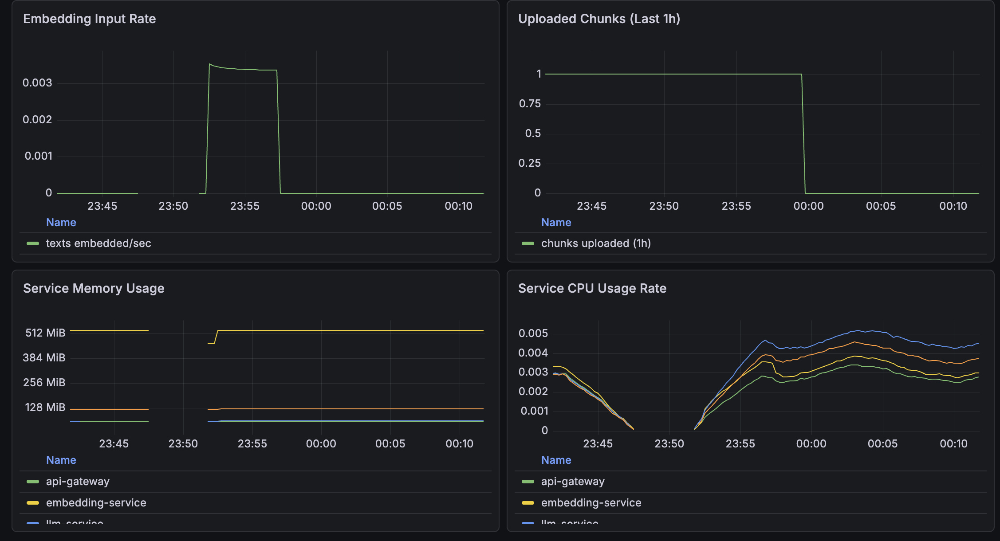
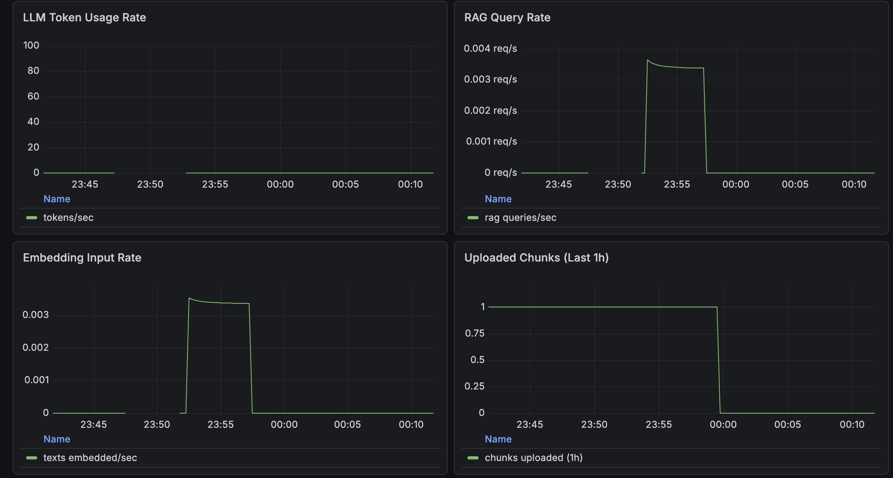

# Mini OpenAI Platform

This is a production-style AI platform built with FastAPI microservices, Qdrant, Docker Compose, Prometheus and Grafana.

The platform exposes OpenAI-like APIs for:
- chat completions
- embeddings
- document upload
- RAG

---

## Architecture


## RAG Flow
```
Client
  │
  │ POST /v1/rag/query
  ▼
API Gateway
  │
  │ validate token + request_id
  ▼
RAG Service
  │
  │ 1. Embed query
  ▼
Embedding Service
  │
  │ query vector
  ▼
RAG Service
  │
  │ 2. Retrieve top-k chunks
  ▼
Qdrant
  │
  │ relevant chunks
  ▼
RAG Service
  │
  │ 3. Build grounded prompt
  │ 4. Call LLM Service
  ▼
LLM Service
  │
  ▼
Ollama
  │
  │ generated grounded answer
  ▼
LLM Service
  │
  ▼
RAG Service
  │
  │ answer + sources
  ▼
API Gateway
  │
  ▼
Client
```
---

## Services

- **api-gateway** — auth, request IDs, rate limiting, caching, routing
- **llm-service** — text generation using Ollama (`phi3:latest`)
- **embedding-service** — embeddings using `all-MiniLM-L6-v2`
- **rag-service** — ingestion, chunking, retrieval, answer generation
- **qdrant** — vector database
- **prometheus** — metrics
- **grafana** — dashboards

---

## Features
- API gateway routing
- request tracing with X-Request-ID
- API key auth
- rate limiting
- response caching
- **semantic caching for RAG queries** — semantically similar queries skip the LLM entirely
- persistent Qdrant storage
- Prometheus + Grafana monitoring (including cache hit rate and LLM time saved)
- Docker healthchecks
- GitHub Actions CI

## Semantic Cache

Exact-match caches are nearly useless for natural language — "how does RAG work?"
and "explain how retrieval augmented generation works" never share a cache key.
This platform caches at the *meaning* level instead:

1. Every answered RAG query is stored in a dedicated Qdrant collection
   (`rag_semantic_cache`) keyed by its **query embedding**, along with the
   answer, sources, and how long generation took.
2. New queries are embedded (which the RAG flow needs anyway), then checked
   against the cache first. A cosine similarity above the threshold
   (default `0.95`) returns the cached answer — skipping retrieval and the
   LLM call entirely.
3. Entries expire after a TTL (default 10 min), and the whole cache is
   invalidated when new documents are uploaded, since the corpus changed.

Cached responses are marked with `"cached": true`, and Prometheus tracks
`rag_semantic_cache_hits_total`, `rag_semantic_cache_misses_total`, and
`rag_semantic_cache_latency_saved_seconds_total` — the Grafana dashboard
shows the hit rate and total LLM generation time saved.

Tuning (env vars on `rag-service`):

| Variable | Default | Meaning |
|---|---|---|
| `SEMANTIC_CACHE_ENABLED` | `true` | turn the cache on/off |
| `SEMANTIC_CACHE_SIMILARITY_THRESHOLD` | `0.95` | min cosine similarity for a hit |
| `SEMANTIC_CACHE_TTL_SECONDS` | `600` | entry lifetime |

## RAG Evaluation & Quality Gate

Most RAG demos can serve answers but cannot tell you whether they are any
good. This platform ships its own evaluation harness and **blocks CI when
retrieval quality regresses**.

The pieces (all under `evals/`):

- **`corpus/`** — a small evaluation corpus of three documents on distinct
  topics, so retrieval mistakes are detectable
- **`golden.jsonl`** — golden questions, each with `expected_phrases` that
  must appear in a retrieved chunk and a `reference_answer` for judging
- **`run_eval.py`** — uploads the corpus, runs every golden question, and
  computes:
  - **hit rate (recall@k)** — did any retrieved chunk contain an expected phrase?
  - **MRR** — how high was the first relevant chunk ranked?
  - **faithfulness** (optional, needs the LLM) — an LLM judge scores each
    generated answer 1–5 against the reference answer

Run the retrieval-only gate (no LLM needed — this is what CI runs):

```bash
python evals/run_eval.py --retrieval-only --min-hit-rate 0.8 --min-mrr 0.5
```

Run the full evaluation including LLM-judged answer quality:

```bash
python evals/run_eval.py --min-hit-rate 0.8 --min-mrr 0.5 --min-faithfulness 3.5
```

The script writes `evals/report.json` with per-question results and exits
non-zero if any threshold is missed. The `rag-quality-gate` CI job spins up
qdrant + embedding-service + rag-service (no Ollama required, thanks to the
LLM-free `POST /retrieve` endpoint) and fails the build on regression.

> Note: the eval uploads its corpus into the running platform's Qdrant
> collection, so prefer running it against a dev stack.

The rag-service also exports retrieval-quality metrics at runtime —
`rag_retrieval_top_score` (similarity of the best chunk per query) and
`rag_insufficient_context_answers_total` (answers that said the context was
insufficient) — both graphed in the Grafana dashboard.

## Start the platform
```bash
docker compose -f infrastructure/compose/docker-compose.yml up -d --build
```
## Check Services
```bash
docker compose -f infrastructure/compose/docker-compose.yml ps
curl http://localhost:8000/health
curl http://localhost:8001/health
curl http://localhost:8002/health
curl http://localhost:8003/health
```
## API Examples
### Auth:
```http
Authorization: Bearer dev-secret-key
```
### Chat
```bash
curl -X POST http://localhost:8000/v1/chat/completions \
  -H "Content-Type: application/json" \
  -H "Authorization: Bearer dev-secret-key" \
  -d '{
    "model": "phi3:latest",
    "messages": [{"role": "user", "content": "Explain what are vector databases briefly."}],
    "temperature": 0.7,
    "max_tokens": 80,
    "stream": false
  }'
```
### Embeddings
```bash
curl -X POST http://localhost:8000/v1/embeddings \
  -H "Content-Type: application/json" \
  -H "Authorization: Bearer dev-secret-key" \
  -d '{
    "model": "sentence-transformers/all-MiniLM-L6-v2",
    "input": ["Embeddings help semantic search."]
  }'
```
### Upload document
```bash
curl -X POST http://localhost:8000/v1/documents/upload \
  -H "Authorization: Bearer dev-secret-key" \
  -F "file=@sample_rag.txt"
```
### RAG query
```bash
curl -X POST http://localhost:8000/v1/rag/query \
  -H "Content-Type: application/json" \
  -H "Authorization: Bearer dev-secret-key" \
  -d '{
    "query": "How does retrieval augmented generation work?",
    "top_k": 2
  }'
```
---

## Deployment/infrastructure
```
┌─────────────────────────────────────────────────────┐
│                 Docker Compose Stack                │
│-----------------------------------------------------│
│                                                     │
│  api-gateway        :8000                           │
│  llm-service        :8001                           │
│  embedding-service  :8002                           │
│  rag-service        :8003                           │
│  qdrant             :6333                           │
│  prometheus         :9090                           │
│  grafana            :3000                           │
│                                                     │
└─────────────────────────────────────────────────────┘

Host machine also runs:
┌──────────────────────┐
│        Ollama        │
│       :11434         │
└──────────────────────┘
```
## CI
```bash
pip install -r requirements-dev.txt
pytest tests -q
docker compose -f infrastructure/compose/docker-compose.yml config >/dev/null && echo OK
```
Workflow:
```
.github/workflows/ci.yml
```
## Grafana dashboards


